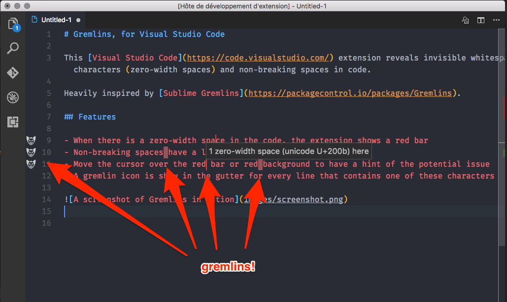

[](https://marketplace.visualstudio.com/items?itemName=nhoizey.gremlins)
[](https://marketplace.visualstudio.com/items?itemName=nhoizey.gremlins)
[](https://travis-ci.org/nhoizey/vscode-gremlins)

# Gremlins, for Visual Studio Code

This [Visual Studio Code](https://code.visualstudio.com/) extension reveals some characters that can be harmful because they are invisible or looking like legitimate ones.

Heavily inspired by [Sublime Gremlins](https://packagecontrol.io/packages/Gremlins).

## Features

- When there is a zero-width space in the code, the extension shows a red bar
- A few characters that can be harmful have a light red or orange background
  - Non-breaking spaces
  - Left and right double quotation marks
- Move the cursor over the character to have a hint of the potential issue
- A gremlin icon is shown in the gutter for every line that contains at least one of these characters



## Adding new gremlins characters

The list of supported characters is an array at the begining of the extension source code:

```javascript
const gremlinsConfig = {
  '200b': {
    zeroWidth: true,
    description: 'zero width space',
  },
  '00a0': {
    description: 'non breaking space',
  },
  '201c': {
    description: 'left double quotation mark',
    backgroundColor: 'rgba(255,127,80,.5)',
    overviewRulerColor: 'rgba(255,127,80,1)',
  },
  …
}
```

Please help enhance the extension by suggesting new characters, through Pull Requests or Issues.
