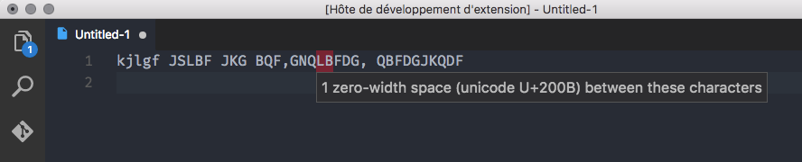

# Gremlins, for Visual Studio Code

This [Visual Studio Code](https://code.visualstudio.com/) extension reveals invisible whitespace characters (zero-width spaces) in code.

Heavily inspired by [Sublime Gremlins](https://packagecontrol.io/packages/Gremlins).

## Features

When there is a zero-width space in the code, the characters before and after will have a red background.

## Known Issues

The extension should use a better visual hint without using other characters around the zero-width space, just like Sublime Gremlins.
