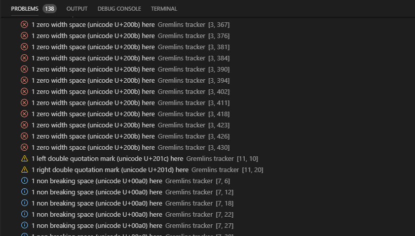

[](https://marketplace.visualstudio.com/items?itemName=nhoizey.gremlins)
[](https://travis-ci.org/nhoizey/vscode-gremlins)
[](CODE_OF_CONDUCT.md)
[](https://marketplace.visualstudio.com/items?itemName=nhoizey.gremlins)

# Gremlins tracker for Visual Studio Code

This [Visual Studio Code](https://code.visualstudio.com/) extension reveals some characters that can be harmful because they are invisible or looking like legitimate ones.

## Features

- When there is a zero-width space in the code, the extension shows a red bar
- When there is a zero-width non-joiner in the code, the extension shows a red bar
- A few characters that can be harmful have a light red or orange background
  - Non-breaking spaces
  - Left and right double quotation marks
  - Etc.
- Some other characters are less harmful, but you might be interested in knowing they're here, so they're also shown, in blue
- Move the cursor over the character to have a hint of the potential issue
- A gremlin icon is shown in the gutter for every line that contains at least one of these characters


You can also use the [“Unicode code point of current character” extension](https://marketplace.visualstudio.com/items?itemName=zeithaste.cursorCharCode) to show information about the character under cursor in the status bar.

## Adding new gremlins characters

You can configure the list of additionnal characters and how they are shown under user settings key `gremlins.characters`.

As an example, the following snippet adds the "U+000C" FORM FEED character:

```
"gremlins.characters": {
  "000c" : {
    "zeroWidth": true,
    "description": "FORM FEED (FF)",
    "backgroundColor": "rgba(255,127,80,.5)",
    "overviewRulerColor": "rgba(255,127,80,1)",
  }
}
```

Please help enhance the extension by suggesting new default characters, through Pull Requests or Issues.

You can find all characters in [Unicode Table](https://unicode-table.com/en/).

## Hiding the gremlin icon in the gutter for a character

You can chose to hide the gremlin icon in the gutter for some characters.

Still under user settings key `gremlins.characters`, you can add the `hideGutterIcon` property to a character (even one from default settings) and set it to true.

For example, this removes the gremlin icon in the gutter for non breakable spaces:

```
"gremlins.characters": {
  "00a0" : {
    "hideGutterIcon": true
  }
}
```

## Displaying gremlins in the Problems pane

By default, gremlins will be highligted in the text editor and an icon will be displayed in the gutter for each line with at least one gremlin. You can toggle whether gremlins also show in the Problems pane with user settings key `gremlins.showInProblemPane`.



## Displaying end-of-line characters

If you want to display end-of-line characters, you can use the [Render Line Endings plugin](https://marketplace.visualstudio.com/items?itemName=medo64.render-crlf).

# Standing on the shoulders of giants

VS Code Gremlins was initialy heavily inspired by [Sublime Gremlins](https://packagecontrol.io/packages/Gremlins), a [Sublime Text](https://www.sublimetext.com/) 3 plugin to help identify invisible and ambiguous Unicode whitespace characters (zero width spaces, no-break spaces, and similar.).

I later discovered the “Gremlins” name had already been used a long time before, in some editors:

[Bare Bones Software](http://www.barebones.com/)'s famous [BBEdit](http://www.barebones.com/products/bbedit/) HTML and text editor for macOS has a “Zap Gremlins” feature since [its first public release April 12th, 1992](https://groups.google.com/forum/#!topic/comp.sys.mac.announce/gvPGyuX3UCs)!

Here's how it looks in recent versions:

<p style="text-align: center"></p>

It looks like people liked this feature so much that they made [a dedicated website](http://zapgremlins.com/), unfortunately not anymore. Thanks Archive.org for [the cached version](https://web.archive.org/web/20120618091150/http://zapgremlins.com/):

<p style="text-align: center"></p>

## License

MIT
